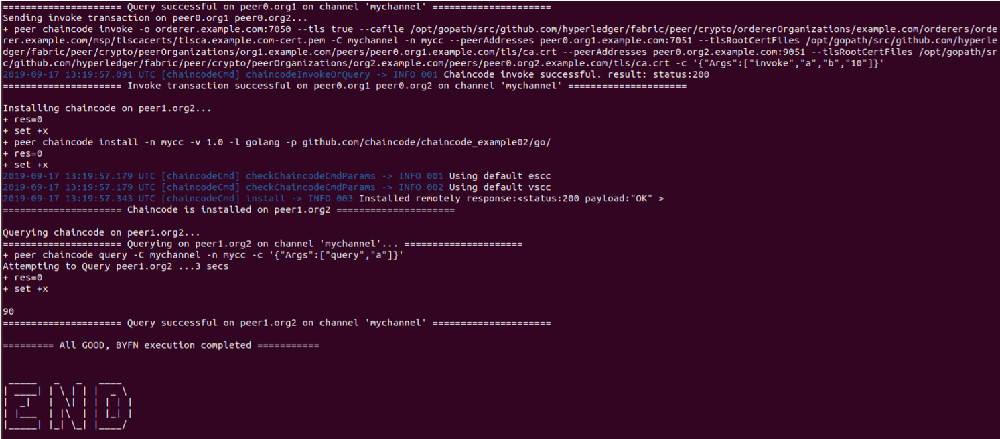
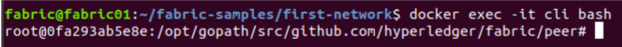
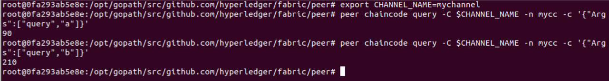
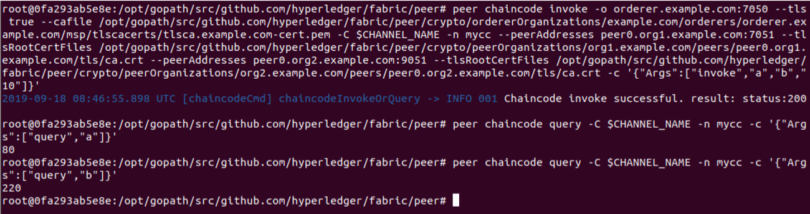
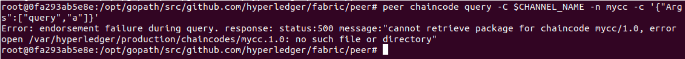
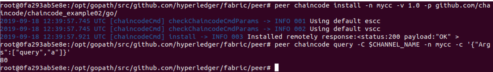
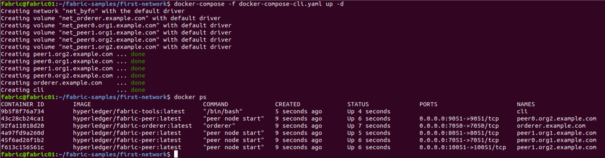

# Hyperledger Fabric 실습

> 실습 버전 : Hyperledger Fabric 1.4.3

##### 참조 환경 변수
~~~shell
## peer0.org1
CORE_PEER_MSPCONFIGPATH=/opt/gopath/src/github.com/hyperledger/fabric/peer/crypto/peerOrganizations/org1.example.com/users/Admin@org1.example.com/msp
CORE_PEER_ADDRESS=peer0.org1.example.com:7051
CORE_PEER_LOCALMSPID=Org1MSP
CORE_PEER_TLS_ROOTCERT_FILE=/opt/gopath/src/github.com/hyperledger/fabric/peer/crypto/peerOrganizations/org1.example.com/peers/peer0.org1.example.com/tls/ca.crt

## peer1.org1
CORE_PEER_MSPCONFIGPATH=/opt/gopath/src/github.com/hyperledger/fabric/peer/crypto/peerOrganizations/org1.example.com/users/Admin@org1.example.com/msp
CORE_PEER_ADDRESS=peer1.org1.example.com:8051
CORE_PEER_LOCALMSPID=Org1MSP
CORE_PEER_TLS_ROOTCERT_FILE=/opt/gopath/src/github.com/hyperledger/fabric/peer/crypto/peerOrganizations/org1.example.com/peers/peer1.org1.example.com/tls/ca.crt

## peer0.org2
CORE_PEER_MSPCONFIGPATH=/opt/gopath/src/github.com/hyperledger/fabric/peer/crypto/peerOrganizations/org2.example.com/users/Admin@org1.example.com/msp
CORE_PEER_ADDRESS=peer0.org2.example.com:9051
CORE_PEER_LOCALMSPID=Org2MSP
CORE_PEER_TLS_ROOTCERT_FILE=/opt/gopath/src/github.com/hyperledger/fabric/peer/crypto/peerOrganizations/org2.example.com/peers/peer0.org2.example.com/tls/ca.crt

## peer1.org2
CORE_PEER_MSPCONFIGPATH=/opt/gopath/src/github.com/hyperledger/fabric/peer/crypto/peerOrganizations/org2.example.com/users/Admin@org2.example.com/msp
CORE_PEER_ADDRESS=peer1.org2.example.com:10051
CORE_PEER_LOCALMSPID=Org2MSP
CORE_PEER_TLS_ROOTCERT_FILE=/opt/gopath/src/github.com/hyperledger/fabric/peer/crypto/peerOrganizations/org2.example.com/peers/peer1.org2.example.com/tls/ca.crt
~~~

## First network 실습
먼저 fabric-samples의 first-network를 실행하여 동작을 확인해 보겠습니다.
first-network는 1개의 Orderer, 4개의 Peer(두 개의 조직에 각 2개의 Peer로 구성 됨)로 이루어져 있습니다.

다수의 컨테이너를 쉽게 괸라하기 위해서 docker-compose 툴을 사용하도록 샘플들이 만들어져있습니다.

1. first network 시작

~~~shell
cd fabric-samples/first-network
./byfn.sh up
~~~

위의 명령 실행 후 아래와 같은 결과가 나오면 정상적으로 `first-network`가 실행되었습니다.

2. 트랜잭션 실행

CLI 컨테이너에 접속합니다.
~~~shell
docker exec -it cli bash
~~~

CLI 컨테이너에 접속하였으면 Query 트랜잭션을 실행하여 현재 저장되어 있는 `a,b`의 값을 조회합니다.
~~~shell
export CHANNEL_NAME=mychannel
peer chaincode query -C $CHANNEL_NAME -n mycc -c '{"Args":["query","a"]}'
peer chaincode query -C $CHANNEL_NAME -n mycc -c '{"Args":["query","b"]}'
~~~

이번에는 Invoke 트랜잭션을 통해 `a,b`의 값을 변경하고 다시 조회해 보겠습니다.
~~~shell
peer chaincode invoke -o orderer.example.com:7050 --tls true --cafile /opt/gopath/src/github.com/hyperledger/fabric/peer/crypto/ordererOrganizations/example.com/orderers/orderer.example.com/msp/tlscacerts/tlsca.example.com-cert.pem -C $CHANNEL_NAME -n mycc --peerAddresses peer0.org1.example.com:7051 --tlsRootCertFiles /opt/gopath/src/github.com/hyperledger/fabric/peer/crypto/peerOrganizations/org1.example.com/peers/peer0.org1.example.com/tls/ca.crt --peerAddresses peer0.org2.example.com:9051 --tlsRootCertFiles /opt/gopath/src/github.com/hyperledger/fabric/peer/crypto/peerOrganizations/org2.example.com/peers/peer0.org2.example.com/tls/ca.crt -c '{"Args":["invoke","a","b","10"]}'
~~~

~~~shell
peer chaincode query -C $CHANNEL_NAME -n mycc -c '{"Args":["query","a"]}'
peer chaincode query -C $CHANNEL_NAME -n mycc -c '{"Args":["query","b"]}'
~~~

위의 트랜잭션을 실행하여 아래와 같은 결과를 확인 할 수 있습니다.

현재 설치된 체인코드는 자산의 이동을 아주 간략하게 작성한 체인코드로 체인코드가 초기화 될 때 (instantiate) `a`에 `100`, `b`에 `200` 값을 입력하였습니다.

그리고 `invoke`가 호출 시 마다 `a,b,10`의 인자로 호출하는데 이 때 `a`에서 `10`을 빼서 `b`로 이동하게 됩니다. 

위의 예제에서 한 번의 `invoke` 호출 전 후를 비교해 보시면 알 수 있습니다.

지금까지는 org1의 peer0에서 트랜잭션을 실행했습니다. 이번에는 다른 peer (org1 peer1) 에서 테스트 해보겠습니다.

먼저 상단에 `참조 환경 변수`에서 `peer1.org1`을 복사하여서 터미널에 입력합니다.
~~~shell
CORE_PEER_MSPCONFIGPATH=/opt/gopath/src/github.com/hyperledger/fabric/peer/crypto/peerOrganizations/org1.example.com/users/Admin@org1.example.com/msp
CORE_PEER_ADDRESS=peer1.org1.example.com:8051
CORE_PEER_LOCALMSPID=Org1MSP
CORE_PEER_TLS_ROOTCERT_FILE=/opt/gopath/src/github.com/hyperledger/fabric/peer/crypto/peerOrganizations/org1.example.com/peers/peer1.org1.example.com/tls/ca.crt
~~~
입력 후 Query 트랜잭션을 실행해 봅니다.
~~~shell
peer chaincode query -C $CHANNEL_NAME -n mycc -c '{"Args":["query","a"]}'
~~~
명령을 실행하면 아래 스크린샷과 같은 에러가 발생합니다. 이는 `peer1.org1` 에는 체인코드가 설치되어 있지 않다는 에러 메시지 입니다.

그럼 체인코드 설치하고 다시 Query 트랜잭션을 실행합니다.
~~~shell
peer chaincode install -n mycc -v 1.0 -p github.com/chaincode/chaincode_example02/go/
peer chaincode query -C $CHANNEL_NAME -n mycc -c '{"Args":["query","a"]}'
~~~
위의 명령을 실행 결과 아래 스크린샷처럼 정상적으로 체인코드가 설치되었다는 메시지와 Query 결과를 확인 할 수 있습니다.

실습을 종료하기 위해서 다음의 명령을 실행합니다.
~~~shell
./byfn.sh down
~~~

## First network bootstrap 

1. Fabric network bootstrap을 위한 아티팩트 만들기   
    * Crypto Generator   
    
    블록체인 네트워크를 구성하는 다양한 엔티티에서 사용하게 될 x509 기반 인증서를 생성합니다.   
crypto-config.yaml 파일에 필요한 네트워크 토폴로지를 작성해서 툴을 실행하면 Organization별로 루트 인증서(ca-cert), 개인키(keystore), 공개키(signcerts) 가 생성됩니다.   
다음 명령을 통해서 인증서를 생성합니다.      
    ~~~shell
    cd $HOME/fabric-samples/first-network
    ../bin/cryptogen generate --config=./crypto-config.yaml
    ~~~   
    * Configuration Transaction Generator   

    configtxgen 은 블록체인 네트워크를 시작 시 필요한 아티팩트를 생성하는 도구이며, Orderer를 위한 bootstrap block, Fabric 채널 설정 파일, Anchor peer 설정 파일로 구성돼 있습니다.    
    우선 다음 명령을 통해서 `orderer genesis block`을 만듭니다.
    ~~~shell
    FABRIC_CFG_PATH=$PWD
    ../bin/configtxgen -profile TwoOrgsOrdererGenesis -channelID byfn-sys-channel -outputBlock ./channel-artifacts/genesis.block
    ~~~   
    다음으로는 채널 아티팩트를 만듭니다.
    ~~~shell
    export CHANNEL_NAME=mychannel
    ../bin/configtxgen -profile TwoOrgsChannel -outputCreateChannelTx ./channel-artifacts/channel.tx -channelID $CHANNEL_NAME
    ~~~
    Anchor 피어 아티팩트를 만듭니다.
    ~~~shell
    ../bin/configtxgen -profile TwoOrgsChannel -outputAnchorPeersUpdate ./channel-artifacts/Org1MSPanchors.tx -channelID $CHANNEL_NAME -asOrg Org1MSP
    ../bin/configtxgen -profile TwoOrgsChannel -outputAnchorPeersUpdate ./channel-artifacts/Org2MSPanchors.tx -channelID $CHANNEL_NAME -asOrg Org2MSP
    ~~~

1. Fabric Network 실행   
아티팩트들이 모두 만들어 졌으면 Fabric network 설정을 위해서 컨테이너들을 실행합니다.
    ~~~shell
    docker-compose -f docker-compose-cli.yaml up -d
    ~~~
    정상적으로 실행되었으면 아래 스크린샷과 같이 6개의 컨테이너를 확인 할 수 있습니다.   
    
1. 채널 생성
1. 채널에 피어 참여
1. Anchor 피어 설정
1. 체인코드 설치
1. 체인코드 초기화
1. 트랜잭션 테스트